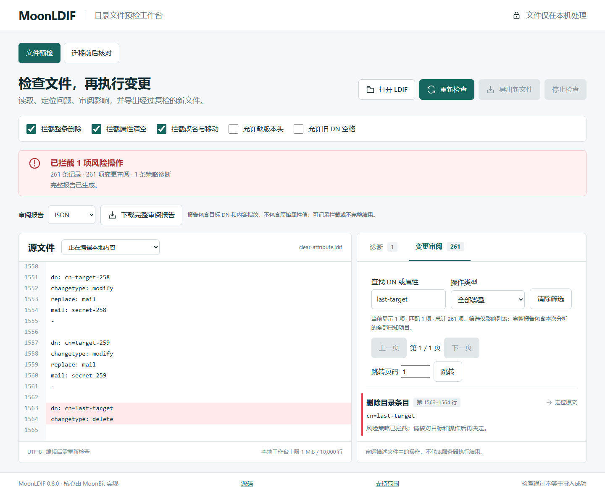

# v0.6.0 公开工作台验证

结果：通过。2026-09-22 对 https://weir-h.github.io/moonldif/ 的实际 0.6.0 页面执行验证。

| 环境 | 结果 |
|---|---|
| Windows Chromium 151.0.7922.34 | 通过 |
| Windows Firefox 153.0 | 通过 |
| 桌面 1440×1080、手机视口 390×844 | 通过；手机尺寸是模拟，不是真机验证 |

## 已执行流程

- 确认项目、页脚版本、非空页面；无覆盖错误界面、控制台错误或失败资源响应。
- 操作审阅与迁移核对：尾部查找、类型筛选、跨页与页码跳转、原文定位、完整 JSON / Markdown 下载；筛选不改变完整报告和风险状态。
- 编辑、策略切换、连续查询、模式切换、停止、迟到结果、超时、超限与无效编码：旧结果不得下载。模式切换保留输入并要求重新检查。
- 每个浏览器 50 次分析与 50 次取消回调验证，最多一个活动 Worker。内存记录是主页面观察，排除 Worker 和进程峰值，不据此宣称无泄漏。
- 整理后的下载 LDIF 再由 CLI 核对；源指纹、Markdown 转义和属性值省略检查通过。
- 实际请求仅加载本站页面及静态脚本、样式、Worker；无输入上传接口。

本次环境未提供 Browser 插件，使用现有 Playwright 验证脚本：`node scripts/browser-verify.mjs https://weir-h.github.io/moonldif/`。详细断言、网络和错误列表见 [运行记录](public-browser-result.json)，循环观察见 [Chromium](public-chromium-stability.json) / [Firefox](public-firefox-stability.json)。输入都是合成样本，自动化验证不称为真实使用者试用。

## 截图

