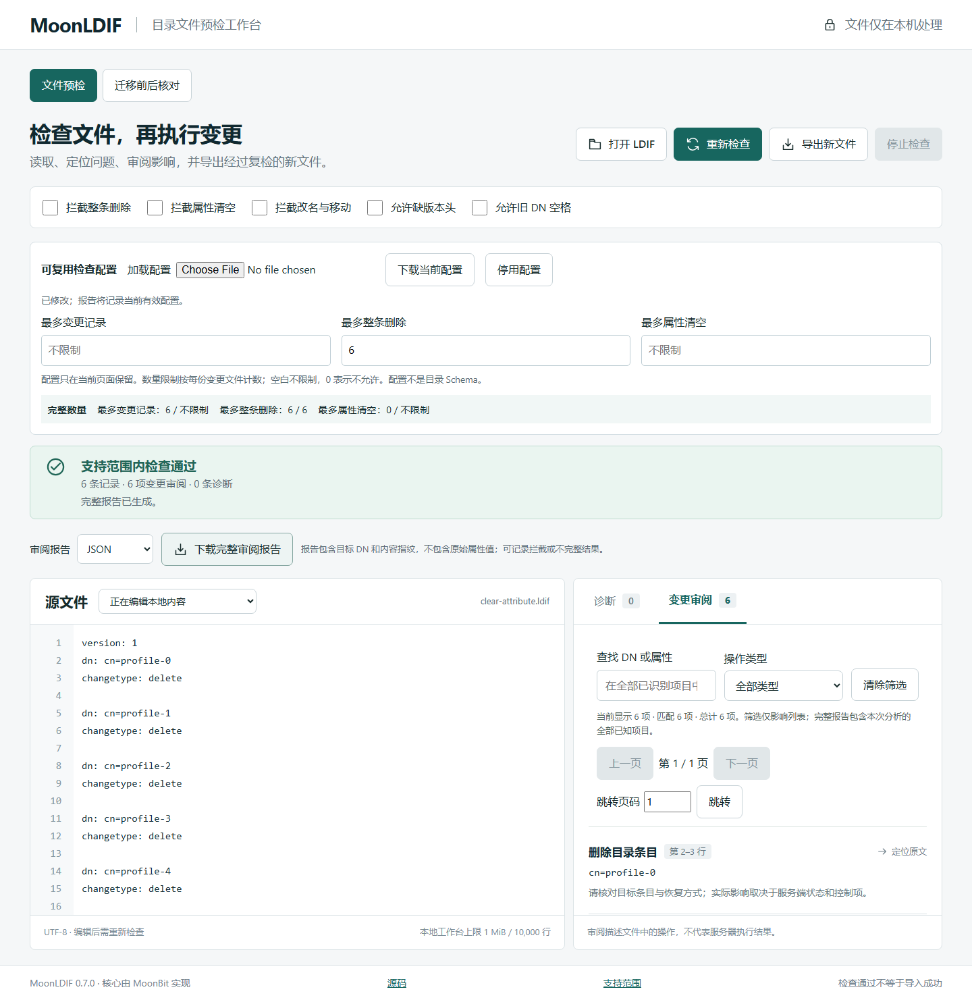

# v0.7.0 公开工作台验证

结果：通过。入口 https://weir-h.github.io/moonldif/ ，页脚 0.7.0。

环境：Windows、Chromium / Firefox，实际版本见 public-browser-result.json；桌面 1440×1080 和手机视口 390×844。手机视口是模拟，不是真机。

| 检查 | 结果 |
|---|---|
| 页面身份、内容非空、无框架错误遮罩 | 通过 |
| 控制台错误、失败资源及网络请求 | 无相关错误或失败响应；仅本站静态资源 |
| 加载配置、6/5 拦截、定位第六条删除 | 通过 |
| 修改限制为 6、旧结果失效、复检及下载配置 | 通过 |
| JSON / Markdown、输入与有效配置指纹、完整报告 | 通过 |
| 迁移模式只使用比较规则，显式排除可复现 | 通过 |
| 错误配置、慢读取、连续加载、模式切换丢弃旧结果 | 通过 |
| 原有迟到 Worker、超时、每浏览器 50 次检查/取消 | 通过 |
| 整理导出并由 CLI 核对、资源上限、手机宽度 | 通过 |

本环境没有 Browser 插件，使用已有 Playwright 工作流：`node scripts/browser-verify.mjs https://weir-h.github.io/moonldif/`。配置校验和数量规则由 MoonBit 实现。内存数据仅为主页面观察，不涵盖 Worker/进程峰值，不作为无泄漏证明。

详细请求、浏览器版本及检查项见 [原始结果](public-browser-result.json)，循环记录见 public-chromium-stability.json 与 public-firefox-stability.json。所有输入为合成样本；未记录真实企业导入或第三方试用。

