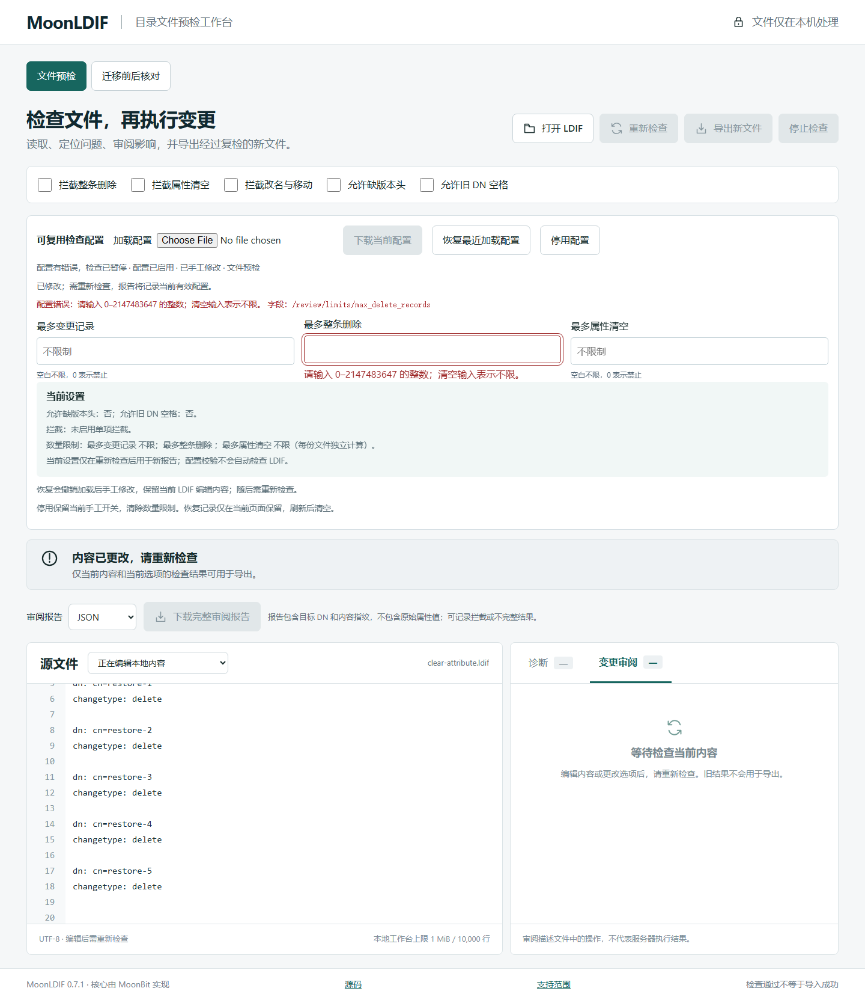
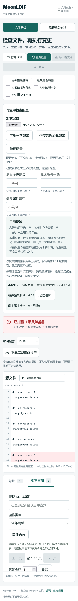

# v0.7.1 工作台验证

结果：通过。公开入口 https://weir-h.github.io/moonldif/ ，版本 0.7.1。

Windows、Chromium / Firefox；桌面 1440×1080 与手机视口 390×844（模拟，非真机）。Browser 插件未提供，使用现有 Playwright 工作流。

| 检查 | 结果 |
|---|---|
| 页面身份、非空、无框架错误遮罩 | 通过 |
| 控制台、静态资源与外部请求 | 无相关错误；仅本站静态资源 |
| 字段中文提示、300 毫秒校验、禁用旧下载 | 通过 |
| 键盘恢复、停用后恢复、加载失败不可绕过 | 通过 |
| 两模式隔离、快速输入与迟到校验 | 通过 |
| 恢复配置指纹、完整报告与 CLI 等价 | 通过 |
| 原有编辑、定位、分页、整理写出、50 次检查/取消 | 通过 |
| 手机宽度与错误提示关联 | 通过 |

流程：载入限额 5 的配置 → 六条删除被拦截 → 输入非法值立即禁用旧结果 → 修正 → 键盘恢复为 5 → 复检并下载 → CLI 使用原配置得到相同规则、指纹与审阅条目。迟到校验用独立页面延迟核心模块响应复现。

复现命令：`node scripts/browser-verify.mjs https://weir-h.github.io/moonldif/`。浏览器版本、请求与检查项见 public-browser-result.json；50 次循环见 public-*-stability.json。内存仅为页面观察，不是进程峰值或无泄漏证明。输入为合成样本，无真实企业数据或第三方试用声明。

